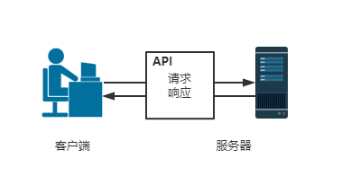

# API 管理

API 文档数据是本产品的核心资源，所有功能都围绕 API 文档展开。

## API 是什么？

API 的全称是 Application Programming Interface，直译过来是**程序之间的接口**，可以理解为连接两个程序的桥梁。

在 Web 中常用的 HTTP API 通过**传输请求数据**和**返回响应数据**连接了客户端和服务器。

举个最常见的例子：用户在 Web 的操作界面输入了账号、密码后，浏览器作为客户端将数据通过 API 发送到服务端。

服务端验证用户信息是否正确，再通过 API 返回给客户端，流程如下图：

通过 API 我们就连接了 Web 客户端和服务器两个程序。

## 我们为什么要管理 API？

