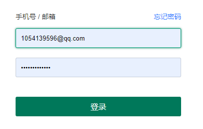

## API 是什么？

API 的全称是 Application Programming Interface，直译过来是**应用程序之间的接口**，首先提到接口我们会想到什么，反正我首先想到的是 USB 数据线，我们可以通过它将数据从手机传输到电脑。

数据线就是电脑和手机的接口，将程序世界类比物理世界，API 可以是一种遵循 HTTP 的定义，用户通过它在互联网传输数据；API 可以是一段函数代码，另外一块代码通过调用它来实现不属于自己模块的逻辑。

在 Web 中，我们通过最常见的 HTTP API 传输 **请求数据**和**响应数据** 连接了客户端和服务端。

举个最常见的例子：用户在 Web 的操作界面输入了账号、密码后，浏览器作为客户端将数据通过 API 发送到服务端。

服务端验证用户信息是否正确，再通过 API 返回给客户端，流程如下图：

通过 API 我们就连接了 Web 客户端和服务器两个程序，API 数据是 Eoapi 的核心，在 Eoapi 上你可以托管遵循网络协议的 API，例如 HTTP、Websocket、TCP 等等。
> Websocket、TCP 暂未上线，敬请期待